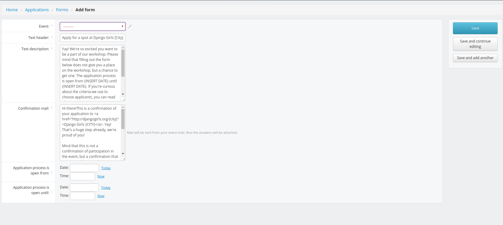
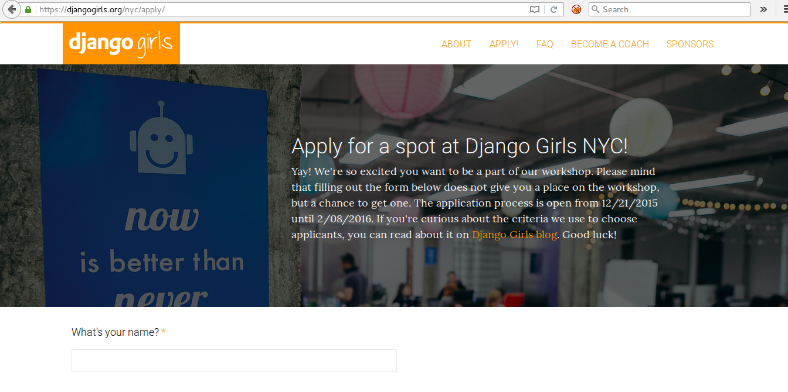

# Application form

## How to create a form on Django Girls website?

You can create one application form for each Django Girls website.
 
To do that:

* Go to your admin interface.
* Click on `Application Form` in the left menu.
* Click on the `+ Add form` green button on the right.
* You'll obtain this page:

Now you should edit out all the texts:

* `Text description`: it's the header of your form. It will appear at the top of the apply page like this:

* `Confirmation email`: This email will be automatically send from your city@djangogirls.org to all applicants after they submit an applications.
* `Application process is open from/until`: Both fields are mandatory. Potential attendees will be able to register only during this period. After that, the form will be automatically deactivated and they won't be able to reach http://djangogirls.org/yourcity/apply (replace `yourcity` with url to your city website).
* Don't forget to save your modifications by clicking on the `save` blue button on the right.

Once you've saved the form, you can access it by going here: http://djangogirls.org/yourcity/apply (replace `yourcity` with url to your city website).

The link to the application form should already be on your website. To check if it's the case or add it:

* Go in your admin interface.
* Click on `Events` in the left menu.
* Click on `Website contents`.
* Click on `apply` in the list.
* Check if ` <a class="btn" href="apply">Register</a>` is there or add it.

The link and the application form will be automatically deactivated at the date you chose when you created it. To prevent any confusion and minimize the "can I still register?" emails, replace the content of `apply` by this text when your registrations are closed:
  
 `Registrations are now closed: we received many applications and are now evaluating them. Acceptance emails will be sent soon!`

### Questions

As you probably noticed, when you create a form, we also automatically add default questions.

To edit a question:

* Go to your admin interface.
* Click on `Application Form` in the left menu.
* Click on `Questions`.
* Click on the question you want to change.
* Maje your changes and click on the `save` blue button on the right.

To remove a question:

* Go to your admin interface.
* Click on `Application Form` in the left menu.
* Click on `Questions`.
* Click on the question you want to delete.
* Click on `delete` button on the right.
* Confirm. It's gone!

Do not remove the question about the Code of Conduct: remember that each event has to follow and enforce our [Code of Conduct](https://djangogirls.org/pages/coc/).

To add a question:

* Go to your admin interface.
* Click on `Application Form` in the left menu.
* Click on `Questions`.
* Click on `+ add question`.
* Chose your event on the list.
* Create the new content.
* Don't forget to save your modifications by clicking on the `save` blue button on the right.

It is also a good idea to ask about previous experience in fields like programming (any language), Python, CSS, HTML, Django, databases etc. With that information, you will be able to team up people based on their levels of experience. Also, ask your attendees what language they are comfortable with. Some of your coaches might only speak English so they will need to coach a group who is comfortable being taught in English, and even if there isn't a translation of your tutorial in your country's language available yet, you can at least make sure that the attendees feel comfortable by having a coach who speaks their language.

### Financial aid questions

If you offer a financial assistance to your attendees, here is a list of example questions:

1. Do you need financial assistance to come and stay in [city]?
2. What is your current financial situation? Tell us why you need financial assistance.
3. How much money do you need? Give us an exact amount of Euro/dollars you need. Try to break down costs.

### Form submit notifications

Once your applicants submit their answer, they will receive an automatic confirmation to their email address with a copy of their responses. Woohoo!

## How to find applicants answers?

To find and evaluate all applications submitted to your event:

* Go to an URL like that: http://djangogirls.org/yourcity/applications/ (remember to replace `yourcity` with your website address)

Or:

* Go to your admin interface.
* Click on `Submitted Applications`.
* You'll be automatically redirect to the applications manager. If you already have organized multiple events, you'll need to chose the event you want in the list.

Or:

* Go to your admin interface.
* Click on `Forms`.
* Click on `See all submitted applications` in the `Applications` column of the table.

## Acceptance/rejection e-mails

To make it easy for you to email all attendees at the same time, we build a way to send the same email to a chosen group of applicants.

In order to do that:

- Go to http://djangogirls.org/yourcity/communication/ (replace `yourcity` with your website address)
- Click the "create new e-mail" button
- You will see a form like that:

 
 
- You can choose the Recipients:
 - `Application submitted` - means everyone with the application status = `submitted`
 - `Application accepted` - means everyone with the application status = `accepted`
 - `Application rejected` - means everyone with the application status = `rejected`
 - `Application on waiting list` - means everyone with the application status = `waiting list`
 - `RSVP: Waiting for response` - means everyone with the application status = `accepted` and rsvp status = `waiting`
 - `RSVP: Confirmed attendance` - means everyone with the application status = `accepted` and rsvp status = `yes`
 - `RSVP: Rejected invitation` - means everyone with the application status = `accepted` and rsvp status = `no`

## What's up with this RSVP thing?

[RSVP](https://en.wikipedia.org/wiki/RSVP_(invitations)) is sent to all accepted attendees. You should ask them if they still can attend the workshop, because otherwise you will give their spot to someone from the waiting list. 

It's hard to gather information about that from ~30-40 people and make sure you won't mix something up, so we build a tool for that too.

When you're sending your acceptance letter to all accepted attendees, make sure to add `RSVP: yes` and `RSVP: no` links to the email. You can do so by clicking the `Add a RSVP: yes link to email` and `Add a RSVP: no link to email` buttons above Recipients field. This will add a placeholder to the content of your email, something looking like that: `[rsvp-url-yes]`. **You should always include both 'yes' and 'no' links!**.

The content of the message should look like that:

    Hey there!
    
    Congratulations! Your application to Django Girls event in City has been approved. We can't wait to meet you on our workshop!
    
    To confirm your attendance, please go to this link: [rsvp-url-yes]
    
    If you can't attend, we would be really grateful if you could let us know earlier, so we can give your place to someone from the waiting list. To let us know, simply click this link: [rsvp-url-no]
    
    Thank you!
    Django Girls team

Our system will replace these tags with unique generated URLs, and log information about which applicant clicked on which link on the list of all applications, so you don't have to track it manually. Yay!