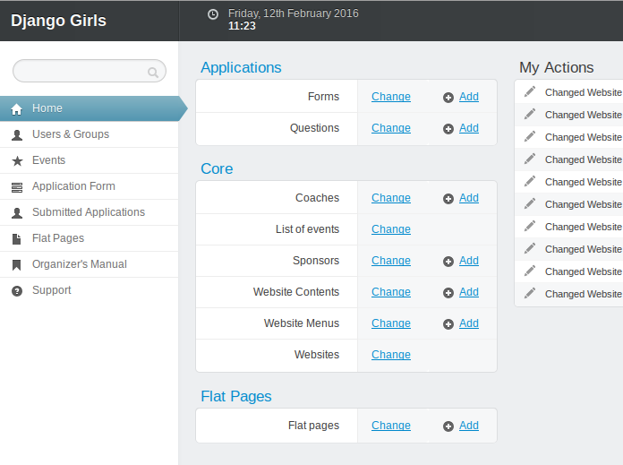
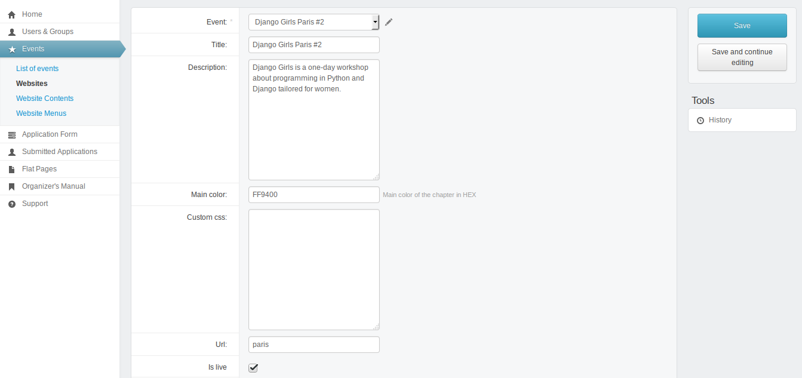
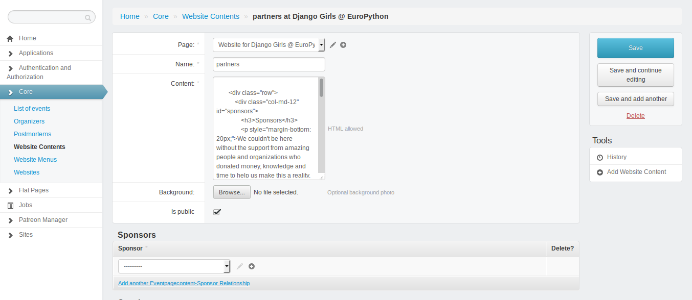

# Website

We have built a simple Django application that allows you to create your events website in a really simple way. You don't have to know how to code to change it but a little knowledge about HTML and CSS will be helpful :).

## Want your website?

Send us an email to [hello@djangogirls.org](mailto:hello@djangogirls.org) and give us the following details:

- Name of the city
- Name of the country
- Date of the event
- URL of the website (http://djangogirls.org/city)
- Name and e-mail address of the team leader
- Names and e-mail addresses of the rest of the team (if any)

You'll receive an access to the Django Admin panel. It looks like this:

You can also change all content on your website:

The website will come with some default content that you can adjust to your needs.

### Adding sponsors to your website

It is possible to add sponsor/partner logos to your website. All you need to do is go to _Core_ -> _Sponsor_ on the admin page and click the _Add sponsor_ button. You should see something like that:

Now you should fill in some fields:

* choose _partners at Django Girls XXX_ (_XXX_ is the name of your city) in _Event page content_
* name of the sponsor in _Name_ field
* choose a picture from your computer with a sponsor's logo. Make sure it is not too big or too small. You can leave this field empty - in this case the name of the sponsor will be displayed instead of the picture.
* add the website address of the sponsor in the _Url_ field
* you can add some extra description, but we usually leave it empty.

That's it!
