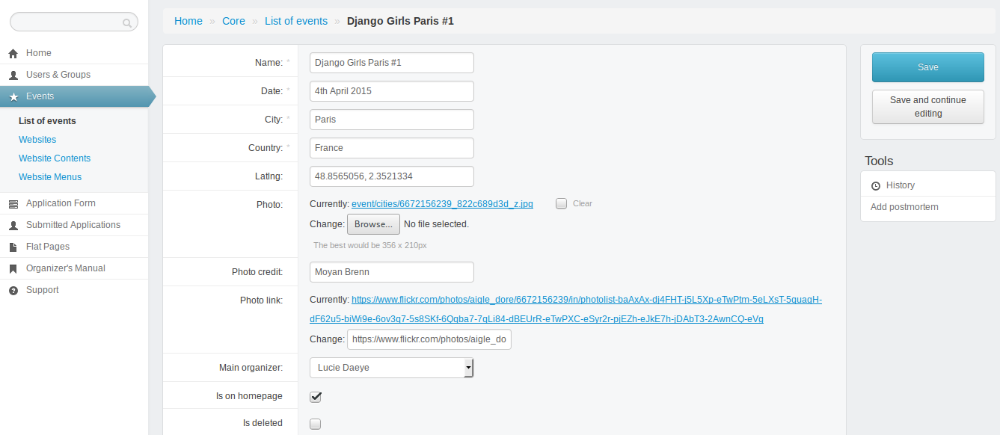
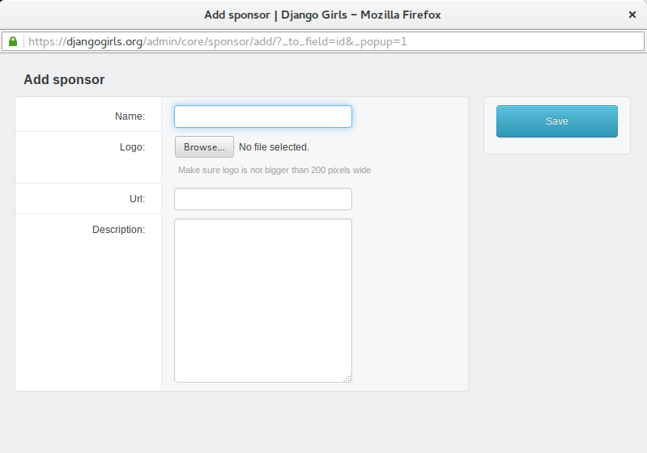
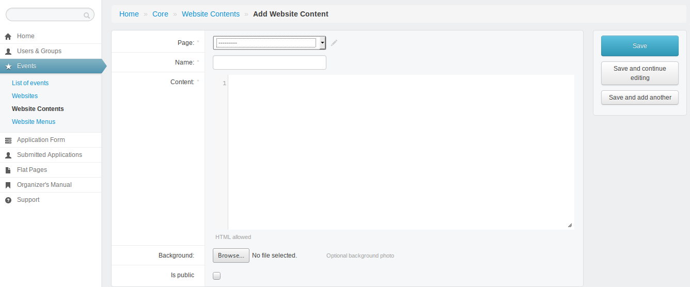

# Administrating your website

We have built a simple Django application that allows you to create your events website in a really simple way. You don't have to know how to code to change it but a little knowledge about HTML and CSS will be helpful :).

Your website will be created after you filled a [request](https://djangogirls.org/organize/) for organizing an event and confirmed you read this manual ;)
Don't forget to give us the name and email address of the other members of your team if you have any.

All your team will receive an access to the Django Admin panel. It looks like this:


On the left menu, you will find everything you need to administrate your website but also link to the organizers manual, Slack and Google Group.

Even if you're familiar with Django admin interface, we strongly recommend you to read this chapter.

## Edit website basic information

Clicking on `Events`, `Websites` and one website listed will get you this page:

TODO: ADD IMAGE

* `Event` and `Title`: Don't edit those field. If you want to modify your website to do another event, send us an [email](mailto:hello@djangogirls.com) and we will deploy a new website for you.
* `Description`: you can edit or translate this field.
* `Main color`: Don't like orange? Chose another color for your website and enter it here in hex format. Try to find a color where white text is still readable.
* `Custom css`: put extra css here.


## Edit your event

You can access and edit basic information about your workshop in the event section of your admin interface:

* Click on `Events` in the left menu.
* Clicked on your event and you will get this page:



You can edit most fields but keep those few rules in mind:

* Don't change the name or the city: if you need to do that, please [contact us](mailto:hello@djangogirls.com).
* You can change the event date if you want to set a more precise date and postpone or delay an event. If you need to do that, keep us posted ;)
* You can modify the cover picture for your event. Remember that this picture should be under Creative Common Licence. To find a new one, you can look on [Flickr](http://flickr.com/) or [Wikipedia](https://en.wikipedia.org/wiki/Main_Page). Don't forget to update photo credit and link.
* You can't edit your team: if you want to add or remove someone, [contact us](mailto:hello@djangogirls.com)
* Don't change the event email: it helps us contact you when we need to do it.

Don't forget to save any modification by clicking on the `Save` button in the right menu.

## Manage and edit content

### Structure of your website

Your website will come with some default sections that you can adjust to your needs:

* `about`: catchphrase for your event!
* `values`: general description of your event.
* `apply`: link to application form for attendees.
* `faq`: questions attendees frequently ask.
* `coach`: information for potential coaches and link to application form.
* `partners`: sponsors!
* `footer`: link to social media and Code of Conduct.

### Edit content

To change the content of your website:

* Click on `Events` in the left menu.
* Go to `Website Contents`.
* Click on the name of the section you want to modify.
* Edit the html in the `Content` field. If the code editor field is too small, you can adapt its size by clicking and dragging the bottom right corner.
* Don't forget to save your modifications by clicking on the `save` blue button on the right.

:tada:

### Create a mailing list

Creating a mailing list is a good way to keep potential attendees and coaches informed about your event. We recommend you to do this if you want to launch your website but can't announce registrations or event dates yet.

To create a mailing list:

* Go to [MailChimp](http://mailchimp.com/) and create a free account.
* Create a list.
* Click on your list in the `lists` tab.
* Click on `Signup forms` and `Embedded form`.
* Edit your form and copy the code.
* Go back to your admin interface in Django Girls website.
* Click on `Events` in the left menu.
* Got to `Website Contents`.
* Click on the name of the section where you want your form to appear.
* Past the code in the `Content` section and save your modifications!

:tada:

We recommend you to read [Getting Started With MailChimp](http://mailchimp.com/resources/guides/getting-started-with-mailchimp/html/) and [Create Signup Forms and Response Emails](http://kb.mailchimp.com/lists/signup-forms/create-signup-forms-and-response-emails) if you want to know more about how to create a mailing list and a signup form.

### How to add sponsors?

First, click on `Events` in the left menu and go to `Website Contents` and click on `partners` in the list. You will obtain this page:


To add a sponsors, go at the bottom of this page and look if your sponsor isn't already in the drop down menu. If it's the case, select it and click on `Add another Eventpagecontent-Sponsor Relationship`. If your sponsor isn't in the menu, click on the `plus` button and a new window will open:



* Add the name of the sponsor.
* Choose a picture from your computer with a sponsor's logo. Make sure it is not too big or too small. You can leave this field empty - in this case the name of the sponsor will be displayed instead of the picture.
* Add the website address of the sponsor.
* You can add some extra description, but we usually leave it empty.
* Click on save.
* Add as many sponsors as you want by clicking on `Add another Eventpagecontent-Sponsor Relationship`.
* Don't forget to save your modifications by clicking on the `save` blue button on the right.

:tada:

### How to add coaches?

You may want to list on your website the awesome people that will coach at your event.

* Click on `Events` in the left menu.
* Go to `Website Contents`.
* Click on the `Add Website Content`green button and you'll open this page:



* Select your website in the `Page` field.
* In `Name`, add `coaches`.
* In content, you can copy-past this: 

```html
<h3>Coaches</h3>
<p>Join these awesome people as Django Girls coach! Contact us!</p>
```

* Don't add a background.
* Check the `Is public` box.
* Don't forget to save your modifications by clicking on the `save` blue button on the right.
* Click on `Website Contents` and click on `Coaches` section.
* Go at the bottom of the page to find `Coaches` section.
* Look if your coaches aren't already in the drop down menu. If they're not, add them by clicking on the `plus` button. The only field required is the name. If you don't have pictures for your coaches, put Django Girls [logo](https://github.com/DjangoGirls/resources/blob/master/Design/Logo/logo_square.png). Click on save.
* Add as many coaches as you want by clicking on `Add another Eventpagecontent-Coach Relationship`.
* Don't forget to save your modifications by clicking on the `save` blue button on the right.

:tada:

## When you're ready!

To make your website available to everyone, click on `Events` in the left menu. Go to `Website` and click on your website in the list. You'll obtain this:


The most important thing here is the `Is live` checkbox. When your website is ready, click on it and save your page. Tada: your website is now online!

Remember that you don't need to make it "live" to test your website: as an administrator of your website, you'll always have to access it.

## What should I do if something isn't working?

First, you can look at our [FAQ](../faq/README.md) to see if your question isn't already answered there. If not, try to contact other organizers on [Slack](https://djangogirls.slack.com/) or [Google Groups](https://groups.google.com/forum/#!forum/django-girls-organizers): they'll be happy to help you! If after doing that you're still stuck, contact the [Support Team](mailto:hello@djangogirls.org).