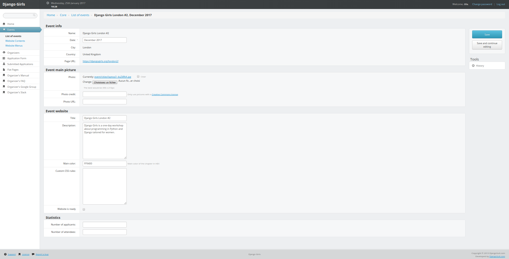

# Edit basic information

## Edit website information

To edit basic information about your event website:

* Click on `Events` in the left menu.
* Click on your event website in the table. You will get you this page:

### `Event info` section:

* `Name`, `City`, `Country`, `Page URL`: They represent the name of your event, where it's happening and its website address. You can't edit those fields: if you need to do that, please [contact us](mailto:hello@djangogirls.com).
* `Date`: You can edit this field if you need to set a more precise date, postpone or delay an event. If you need to cancel your workshop, keep us posted ;\)

### `Event main picture` section:

`Photo`, `Photo credit`, `Photo link`: Those fields are connected to the cover picture of your event on the [events list page](https://djangogirls.org/events/) of Django Girls website. We already gave you one so you don't need to edit those fields. If you need to change it, only use pictures under Creative Common License and don't forget to update photo credit and link.

### `Event website` section:

* `Title`: It represents the name of your event website.
* `Description`: you can edit or translate this field.
* `Main color`: Don't like orange? Chose another color for your website and enter it here in hex format. Try to chose a color on which white text is still readable.
* `Custom css`: put extra css here.
* `Website is ready`: When you've finished to edit your website content and want to make it live, check this box and click on `Save` in the right menu. Keep in mind that you don't need to do that to test your website: it will always be live for you and people on your organizing team.

Don't forget to save your modifications by clicking on the `Save` button in the right menu.

Once your event is done, you won't be able to edit any of those fields. If you need to do that, please send us an [email](mailto:hello@djangogirls.com).

### `Statistics` section:

`Number of applicants` and `Number of attendees`: when your event is done, don't forget to fill those fields. It will help us keep track of how many people attend Django Girls workshop :\)

Don't forget to save your modifications by clicking on the `Save` button in the right menu.

## Add or remove organizer from your team

### To add more organizers

In your admin interface:

* Click on `Organizers` in the left menu or [go here](https://djangogirls.org/admin/core/event/add_organizers/).
* Select your event in the drop down list.
* Add the full name of the new organizer.
* Add the email their email address.
* Click on the `Add organizer` button.

Redo those steps for every organizer you want to add.

### To remove organizers

In your admin interface:

* Click on `Organizers` and `Remove organizers` in the left menu or [go here](https://djangogirls.org/admin/core/event/manage_organizers/).
* Click on the event you want to edit.
* Click on `Remove` next to the person you want to remove.
* Confirm you want to remove the person.

Redo those steps for every organizer you want to remove.

