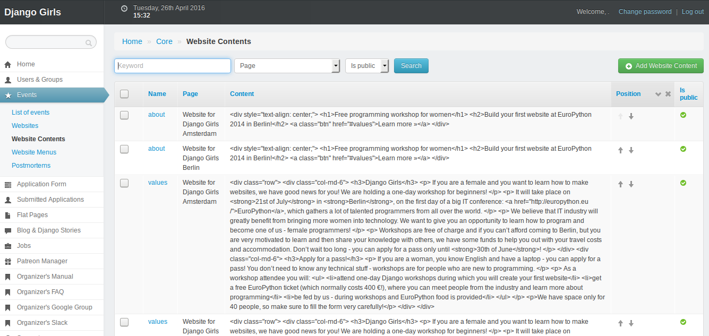
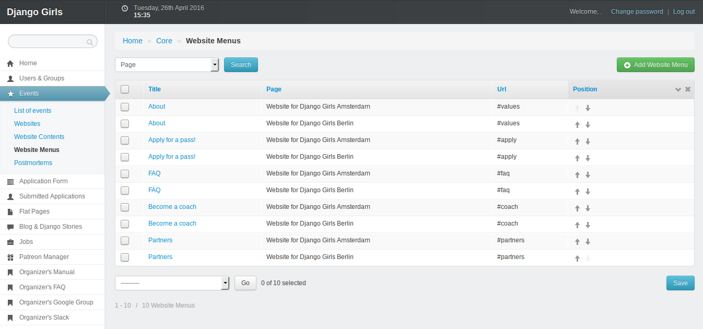

# Manage and edit content

## Structure of your website

### Website sections

When you click on `Events` and `Website Contents`, you get this page:



This page is a list of default sections that you can adjust to your needs:

* `about`: a catchphrase for your event.
* `values`: a general description of your event.
* `apply`: a link to application form for attendees.
* `faq`: questions attendees frequently ask.
* `coach`: information for potential coaches and link to application form.
* `partners`: sponsors list.
* `footer`: links to social media and Code of Conduct.

You can reorder those sections by using their arrows in the `position` column. Don't forget to save your modifications by clicking on the `Save` at the bottom of this page.

To filter sections connected to one event in particular:
* Click on the `Page` drop-down menu.
* Click on an event you're organizing.
* Click on the `Search` button.

:tada:

### Website menu

When you click on `Events` and `Website Menus`, you get this page:



This table is the menu you can see at the top of your event website: every entry is connected to a `Website Content` section.

You can reorder the menu by using up and down arrows in the `Position` column and clicking on the `Save` button at the bottom of the page.

When you click on a menu item, you can modify its title and URL. The structure of your website is already configured: you won't need to change those settings.

To filter menu connected to one event in particular:
* Click on the `Page` drop-down menu.
* Click on an event you're organizing.
* Click on the `Search` button.

## Edit website content

To change the content of your website:

* Click on `Events` in the left menu.
* Go to `Website Contents`.
* Click on the name of the section you want to modify.
* Edit the html in the `Content` field. If the code editor field is too small, you can adapt its size by clicking and dragging the bottom right corner.
* Don't forget to save your modifications by clicking on the `save` blue button on the right.

:tada:

Once your event is done, you won't be able to edit any of those fields. If you need to do that, please send us an [email](mailto:hello@djangogirls.com).

## How to add sponsors?

First, click on `Events` in the left menu and go to `Website Contents` and click on `partners` in the list. You will get this page:


To add a sponsors, go at the bottom of this page and look if your sponsor isn't already in the drop down menu. If it's the case, select it and click on `Add another Eventpagecontent-Sponsor Relationship`. If your sponsor isn't in the menu, click on the `plus` button and a new window will open:


* Add the name of the sponsor.
* Choose a picture from your computer with a sponsor's logo. Make sure it is not too big or too small. You can leave this field empty - in this case the name of the sponsor will be displayed instead of the picture.
* Add the website address of the sponsor.
* You can add some extra description, but we usually leave it empty.
* Click on save.
* Add as many sponsors as you want by clicking on `Add another Eventpagecontent-Sponsor Relationship`.
* Don't forget to save your modifications by clicking on the `save` blue button on the right.

:tada:

Once your event is done, you won't be able to edit any of those fields. If you need to do that, please send us an [email](mailto:hello@djangogirls.com).

## How to add coaches?

You may want to list on your website the awesome people that will coach at your event.

* Click on `Events` in the left menu.
* Go to `Website Contents`.
* Click on the `Add Website Content`green button and you'll open this page:


* Select your website in the `Page` field.
* In `Name`, add `coaches`.
* In content, you can copy-past this:

```html
<h3>Coaches</h3>
<p>Join these awesome people as Django Girls coach! Contact us!</p>
```

* Don't add a background.
* Check the `Is public` box.
* Don't forget to save your modifications by clicking on the `save` blue button on the right.
* Click on `Website Contents`.
* Reorder your sections: use the up and down arrows to move the `Coaches` section where you want it to appear.
* Click on the `Save` button at the bottom of the page.
* Click on `Coaches` section.
* Go at the bottom of the page to find `Coaches` section.
* Look if your coaches aren't already in the drop down menu. If they're not, add them by clicking on the `plus` button. The only field required is the name. If you don't have pictures for your coaches, put Django Girls [logo](https://github.com/DjangoGirls/resources/blob/master/Design/Logo/logo_square.png). Click on save.
* Add as many coaches as you want by clicking on `Add another Eventpagecontent-Coach Relationship`.
* Don't forget to save your modifications by clicking on the `save` blue button on the right.

:tada:

If you can't find your coaches on your website, check if `Is public` box of this section is checked.

Once your event is done, you won't be able to edit any of those fields. If you need to do that, please send us an [email](mailto:hello@djangogirls.com).

## Create a mailing list

Creating a mailing list is a good way to keep potential attendees and coaches informed about your event. We recommend you to do this if you want to launch your website but can't announce registrations or event dates yet.

To create a mailing list:

* Go to [MailChimp](http://mailchimp.com/) and create a free account.
* Create a list.
* Click on your list in the `lists` tab.
* Click on `Signup forms` and `Embedded form`.
* Edit your form and copy the code.
* Go back to your admin interface in Django Girls website.
* Click on `Events` in the left menu.
* Got to `Website Contents`.
* Click on the name of the section where you want your form to appear.
* Past the code in the `Content` section and save your modifications!

:tada:

We recommend you to read [Getting Started With MailChimp](http://mailchimp.com/resources/guides/getting-started-with-mailchimp/html/) and [Create Signup Forms and Response Emails](http://kb.mailchimp.com/lists/signup-forms/create-signup-forms-and-response-emails) if you want to know more about how to create a mailing list and a signup form.