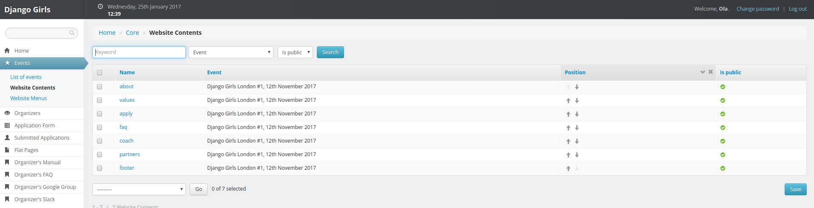

# Edit website content

## Structure of your website

### Website sections

When you click on `Events` and `Website Contents`, you get this page:

This page is a list of default sections that you can adjust to your needs:

* `about`: a catchphrase for your event.
* `values`: a general description of your event.
* `apply`: a link to application form for attendees.
* `faq`: questions attendees frequently ask.
* `coach`: information for potential coaches and link to application form.
* `partners`: sponsors list.
* `footer`: links to social media.

You can reorder those sections by using their arrows in the `position` column. Don't forget to save your modifications by clicking on the `Save` at the bottom of this page.

To filter sections connected to one event in particular:

* Click on the `Page` drop-down menu.
* Click on an event you're organizing.
* Click on the `Search` button.

:tada:

### Website menu

When you click on `Events` and `Website Menus`, you get this page:

This table is the menu you can see at the top of your event website: every entry is connected to a `Website Content` section.

You can reorder the menu by using up and down arrows in the `Position` column and clicking on the `Save` button at the bottom of the page.

When you click on a menu item, you can modify its title and URL. The structure of your website is already configured: you won't need to change those settings.

To filter menu connected to one event in particular:

* Click on the `Page` drop-down menu.
* Click on an event you're organizing.
* Click on the `Search` button.

## Edit website content

To change the content of your website:

* Click on `Events` in the left menu.
* Go to `Website Contents`.
* Click on the name of the section you want to modify.
* Edit the html in the `Content` field. If the code editor field is too small, you can adapt its size by clicking and dragging the bottom right corner. Don't forget to check if every html tag is closed ;\)
* Save your modifications by clicking on the `save` blue button on the right.

:tada:

Once your event is done, you won't be able to edit any of those fields. If you need to do that, please send us an [email](mailto:hello@djangogirls.com).

