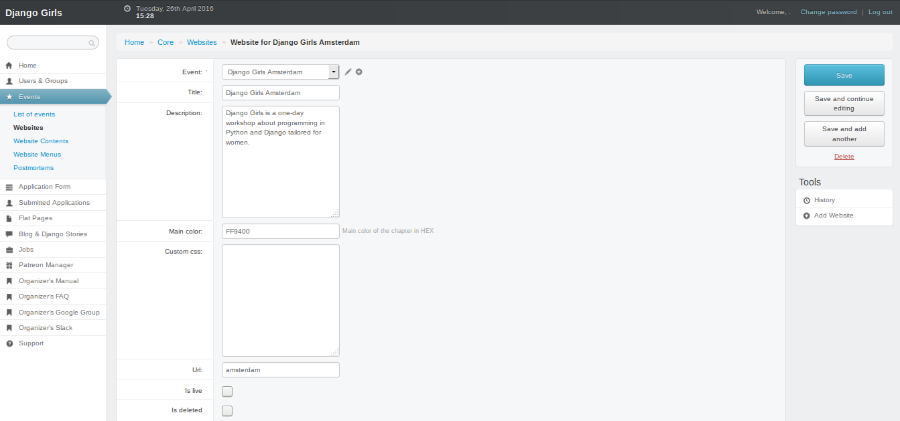

# When you're ready!

## Checklist

Did you...

* edit every sections? Even the footer?
* open your [application form](https://organize.djangogirls.org/application_form/create_manage_form.html)?
* put your definitive date in your [admin interface](https://djangogirls.org/admin/core/event/)?

Then you're go to go!

## Activate your website

To make your website available to everyone, click on `Events` in the left menu and click on your event in the list. You'll obtain this:

When your website is ready, check the `Website is ready` checkbox and save your page. Tada: your website is now online!

Remember that you don't need to make it "live" to test your website: as an administrator of your website, you'll always be able to access it.

# Order a Workshop box

To help you reduce the cost of your event, we created a `Workshop box` full of stickers, name tags, badges and balloons. To order it, [go to our store](https://store.djangogirls.org/products/django-girls-workshop-box).

If your event is taking place in a [developing country](https://en.wikipedia.org/wiki/Developing_country) or if you tried but can't find sponsors for your event, you'll be able to apply for a free box. Here are the requirements to be able to apply for a free box:

* You need to have a venue for your workshop
* Application process for your event needs to already be open
* You need to order it at least 6 weeks before workshop to allow for shipping time

When you meet all those requirements, [send us an email](mailto:hello@djangogirls.org).
